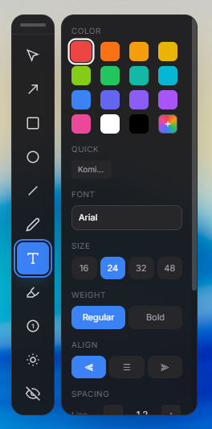
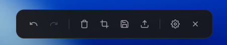

# Video Annotator

Ekranınızın tamamında, şeffaf bir katman üzerinde veya seçtiğiniz herhangi bir görselin üzerinde çizim ve düzenleme yapmanıza olanak tanıyan gelişmiş bir ekran alıntısı ve işaretleme aracıdır.

“Video Annotator” adını taşımasının sebebi ise, klasik ekran alıntısı araçlarından farklı olarak özellikle video düzenleme ile ilgilenen kullanıcıları hedeflemesidir. Video içerisinden alınan karelerin, ana video editörünü kalabalıklaştırmadan, hızlı ve pratik bir şekilde düzenlenmesini sağlayan özel kolaylıklar sunar.

<p align="center">
  
  &nbsp;&nbsp;&nbsp;&nbsp;
  
</p>

## Özellikler

- **Çizim Araçları:** Ok, dikdörtgen, elips, çizgi, serbest çizim, metin, marker
- **Özel Efektler:** Spotlight (vurgulama), Blur/Pixelate (gizleme), Magnifier (büyüteç)
- **Crop:** Belirli bir alanı kırparak kaydetme
- **Numaralandırma:** Otomatik artan numaralar ekleme
- **Upload:** Tek tıkla prnt.sc'ye yükleme ve link kopyalama
- **Drag & Drop:** Kaydedilen dosyayı sürükle-bırak ile paylaşma

## Kurulum

### Hazır Kurulum (Önerilen)

[**Releases**](https://github.com/ruwiss/video-annonator/releases/latest) sayfasından en güncel sürümü indirip kurabilirsiniz.

### Kaynak Koddan Derleme

```bash
# Bağımlılıkları yükle
npm install

# Geliştirme modunda çalıştır
npm run dev
npm start

# Production build
npm run build
npm run package
```

## Kullanım

1. `Ctrl+Shift+A` ile overlay'i aç/kapat
2. Sol panelden araç seç
3. Ekran üzerinde çiz
4. `Ctrl+S` ile kaydet veya upload butonuyla paylaş

## Kısayollar

| Kısayol | İşlev |
|---------|-------|
| `Ctrl+Shift+A` | Overlay aç/kapat |
| `Ctrl+S` | Kaydet |
| `Ctrl+Z` | Geri al |
| `Ctrl+Shift+Z` | Yinele |
| `V` | Seçim |
| `A` | Ok |
| `R` | Dikdörtgen |
| `T` | Metin |
| `S` | Spotlight |
| `B` | Blur |
| `C` | Crop |
| `Esc` | Kapat |

## Teknolojiler

- Electron
- React + TypeScript
- Fabric.js (Canvas)
- Tailwind CSS
- Vite
